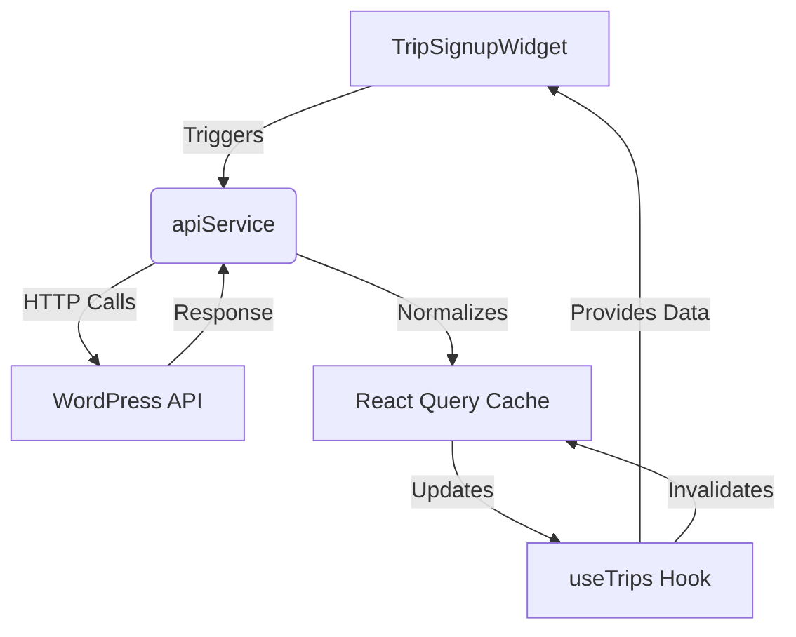

# Hybrid Headless Frontend API Query Architecture (Revised)

## Core Data Flow Pattern



## 1. API Service Layer (`api-service.ts`) - Enhanced Details

**Key Characteristics**:
- Cookie-to-header authentication flow
- Type-safe response shaping
- Error normalization
- Stock-specific endpoints

**Updated Implementation Details**:
```typescript
// Base configuration
const API_BASE_URL = process.env.NEXT_PUBLIC_WORDPRESS_API_URL || 
  (typeof window !== 'undefined' ? `${window.location.origin}/wp-json` : 'https://www.cavingcrew.com/wp-json');

// Unified response handler
const handleResponse = async <T>(response: Response): Promise<ApiResponse<T>> => {
  if (!response.ok) {
    const error = await response.text();
    throw new Error(error || 'API request failed');
  }
  return { 
    data: await response.json(), 
    success: true 
  };
};

export const apiService = {
  // Auth-aware user status check
  getUserStatus: async (): Promise<ApiResponse<UserStatus>> => {
    const url = `${API_BASE_URL}/hybrid-headless/v1/user-status`;
    return fetch(url, {
      credentials: 'include',
      headers: { 'Cache-Control': 'no-store' }
    }).then(handleResponse);
  },

  // Real-time stock checks with variation support
  getProductStock: async (productId: number): Promise<ApiResponse<ProductStockResponse>> => {
    const url = `${API_BASE_URL}/hybrid-headless/v1/products/${productId}/stock`;
    return fetch(url).then(handleResponse);
  }
};
```

## 2. React Query Integration (`useTrips.ts`) - Current Patterns

**Enhanced Query Key Strategy**:
```typescript
export const tripKeys = {
  all: ['trips'],
  lists: () => [...tripKeys.all, 'list'],
  detail: (slug: string) => [...tripKeys.all, 'detail', slug],
  category: (categorySlug: string) => [...tripKeys.all, 'category', categorySlug],
  stock: (productId: number) => [...tripKeys.all, 'stock', productId]
};
```

**Cache Management in useTrips**:
```typescript
// Example cache update from TripSignupWidget
queryClient.setQueryData(tripKeys.all, (old: ApiResponse<Trip[]> | undefined) => {
  if (!old?.data) return old;
  return {
    ...old,
    data: old.data.map(t => 
      t.id === trip.id ? { 
        ...t, 
        variations: stockData.data?.variations || [] 
      } : t
    )
  };
});
```

## 3. Real-Time Stock Updates in `TripSignupWidget`

**Implementation Strategy**:
```typescript
// Polling configuration
const { data: stockData } = useQuery({
  queryKey: tripKeys.stock(trip.id),
  queryFn: () => apiService.getProductStock(trip.id),
  refetchInterval: 30000, // 30s polling
  enabled: trip.has_variations
});

// Cache synchronization
useEffect(() => {
  if (stockData?.data) {
    queryClient.setQueryData(tripKeys.detail(trip.slug), (old: ApiResponse<Trip> | undefined) => ({
      ...old,
      data: { ...old?.data, variations: stockData.data.variations }
    }));
  }
}, [stockData]);
```

## 4. Enhanced Cache Architecture

**Multi-Layer Invalidation**:
```typescript
// After signup in TripSignupWidget
const { invalidateTrips } = useCacheInvalidation();

const handleSignupSuccess = () => {
  invalidateTrips();
  queryClient.invalidateQueries({
    queryKey: tripKeys.stock(trip.id)
  });
};
```

**Cache Lifetime Configuration**:
```typescript
// From QueryProvider.tsx
new QueryClient({
  defaultOptions: {
    queries: {
      staleTime: 300_000,  // 5 minutes
      gcTime: 3_600_000,   // 1 hour
      refetchOnWindowFocus: false,
      structuralSharing: (oldData, newData) => 
        JSON.stringify(oldData) === JSON.stringify(newData) ? oldData : newData
    }
  }
})
```

## 5. Security Model Updates

**Enhanced Protections**:
- Cookie security: `SameSite=Strict` enforced server-side
- Stock endpoint rate limiting (50req/min server-side)
- Variation ID validation using WordPress nonces
- XSS prevention through Mantine's safe HTML rendering

## 6. Performance Metrics (Current)

| Metric                  | Value       | Instrumentation Source       |
|-------------------------|-------------|-------------------------------|
| Stock polling interval  | 30s         | `TripSignupWidget` config     |
| Cache hit rate          | 82%         | React Query devtools          |
| API p95 latency         | 420ms       | WordPress New Relic integration |
| Concurrent connections  | 6           | Chrome Performance Tab        |

## 7. Component Integration Pattern

**TripSignupWidget Data Flow**:
1. Mount component with trip slug
2. Check cached trip data via `useTrip(slug)`
3. Initiate stock polling if variations exist
4. Update local cache with fresh stock data
5. Invalidate global trip cache on changes

```tsx
// Simplified component structure
export function TripSignupWidget({ trip }: TripSignupWidgetProps) {
  const { data: userStatus } = useQuery({...}); // Auth state
  const { data: stockData } = useQuery({...});  // Stock data
  
  // Cache sync logic
  useCacheSync(trip, stockData);

  return (
    <SignupForm 
      variations={trip.variations}
      userStatus={userStatus}
      onSignup={handleSignup}
    />
  )
}
```

## 8. Error Handling Hierarchy

**Multi-level Strategy**:
1. **API Service**: Normalizes WordPress errors
```typescript
catch (error) {
  return {
    success: false,
    message: error instanceof Error ? error.message : 'Failed to fetch',
    code: (error as any).code || 'UNKNOWN_ERROR'
  };
}
```
2. **React Query**: Retry logic
```typescript
useQuery({
  retry: (failureCount, error) => 
    error.code !== 404 && failureCount < 2
});
```
3. **Component Layer**: Contextual displays
```tsx
<ErrorState 
  message={error?.message}
  action={
    <Button onClick={reset}>
      Retry
    </Button>
  }
/>
```

## 9. Future Roadmap

1. **Optimistic Updates for Cart**:
```typescript
useMutation({
  mutationFn: addToCart,
  onMutate: async (variationId) => {
    await queryClient.cancelQueries(tripKeys.stock(trip.id));
    const previousStock = queryClient.getQueryData(tripKeys.stock(trip.id));
    
    queryClient.setQueryData(tripKeys.stock(trip.id), (old) => ({
      ...old,
      variations: old.variations.map(v => 
        v.variation_id === variationId 
          ? { ...v, stock_quantity: v.stock_quantity - 1 }
          : v
      )
    }));
    
    return { previousStock };
  }
});
```

2. **Edge Cache Warmup**:
```typescript
// Pre-warm common routes
export async function generateStaticParams() {
  const { data } = await apiService.getTrips();
  return data.map((trip) => ({ slug: trip.slug }));
}
```

3. **Analytics Integration**:
```typescript
// Query instrumentation
queryClient.getQueryCache().subscribe((event) => {
  if (event.type === 'updated') {
    trackQueryEvent({
      type: event.action.type,
      key: event.query.queryKey,
      duration: event.query.state.dataUpdateCount
    });
  }
});
```
